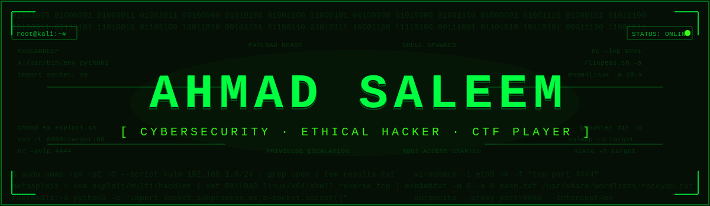
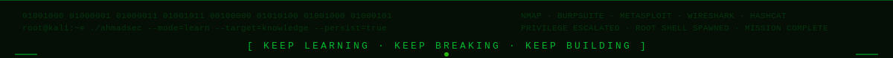

<div align="center">



</div>

---

<div align="center">

### 🧠 *"The quieter you become, the more you can hear — and the more you can hack."*

[](https://git.io/typing-svg)

</div>

---

## 🌟 About Me

```bash
┌──(ahmadsec㉿kali)-[~]
└─$ whoami
```

> 🔐 **Cybersecurity student** with a passion for ethical hacking, penetration testing, and CTF challenges. I don't just learn security — I live it. From setting up Kali Linux labs to actively competing in Capture The Flag events, I'm on a mission to become a world-class security professional.

- 🔭 Currently building **cybersecurity labs** on Kali Linux & VMware
- 🌱 Actively learning **Linux, Python, Networking, Burp Suite, Nmap, Wireshark & Metasploit**
- 🚩 **CTF Competitor** — Team: *Noobz* @ BCT CTF (Cyber Hacktivators Club)
- 🤝 Looking to collaborate on **beginner-friendly security projects & CTF challenges**
- 💬 Ask me about **Kali Linux setup, cybersecurity tools & virtual labs**
- ⚡ Fun fact: I enjoy **breaking systems** to understand how to protect them 😄

---

## 🏆 Certifications & Achievements

<div align="center">

| 🎖️ Certificate | 🏛️ Issuer | 📅 Date |
|---|---|---|
| 🤖 **Gemini 3.0 Unpacked** — Post-DevFest Power Workshop | Google Developer Group Cloud Islamabad | Dec 15, 2025 |
| 🛡️ **Cyber Threat Intelligence 101** — Foundation Level Threat Intelligence Analyst | arcX | Apr 21, 2026 |
| 🚩 **BCT CTF Participation** — Team: Noobz | True Players × Cyber Hacktivators Club | 2025 |

</div>

> 💡 *"Every certificate is a stepping stone. Every CTF flag is a lesson. Keep going."*

---

## 🌐 Connect With Me

<div align="center">

[](https://linkedin.com/in/Ahmad-Saleem)
[](https://discord.gg/ahmadsaleem0166)
[](mailto:ahmadsaleemh70@gmail.com)
[](https://buymeacoffee.com/ahmadsec)

</div>

---

## 🔐 Cybersecurity Arsenal

<div align="center">


</div>

---

## 💻 Tech Stack

<div align="center">

**Languages**


**Cloud & Infrastructure**


**Frameworks & Tools**


**Design**


</div>

---

## 📊 GitHub Stats

<div align="center">


</div>

<div align="center">


</div>

---

## 🏆 GitHub Trophies

<div align="center">


</div>

---

## 🚩 CTF & Security Journey

```
🏁 BCT CTF      → Competed with team "Noobz" under Cyber Hacktivators Club
🛡️ arcX CTI 101 → Earned Foundation Level Threat Intelligence Analyst cert
🤖 GDG DevFest  → Participated in Gemini 3.0 Unpacked workshop (AI + Security)
🔬 Currently    → Building home labs, practicing on HackTheBox / TryHackMe
```

> 🔥 *"Every expert was once a beginner. Every pro was once an amateur. Keep hacking."*

---

## 💡 Motivational Corner

<div align="center">


</div>

---

## 🔝 Top Contributed Repos

<div align="center">


</div>

---

<div align="center">

[](https://github.com/Hackthrons)

### 🔐 *"Security is not a product, but a process. Keep learning. Keep breaking. Keep building."*



</div>
